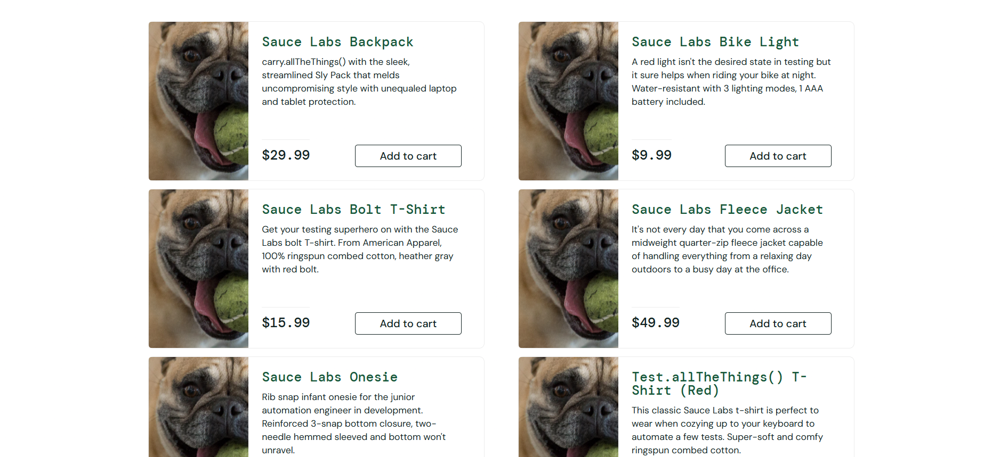
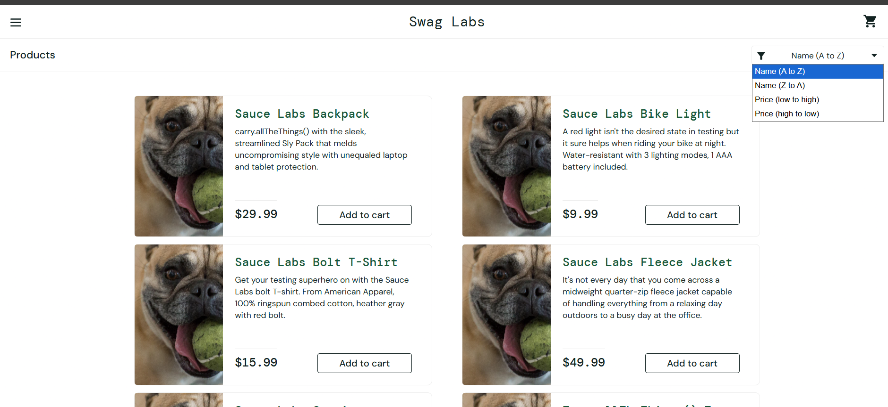
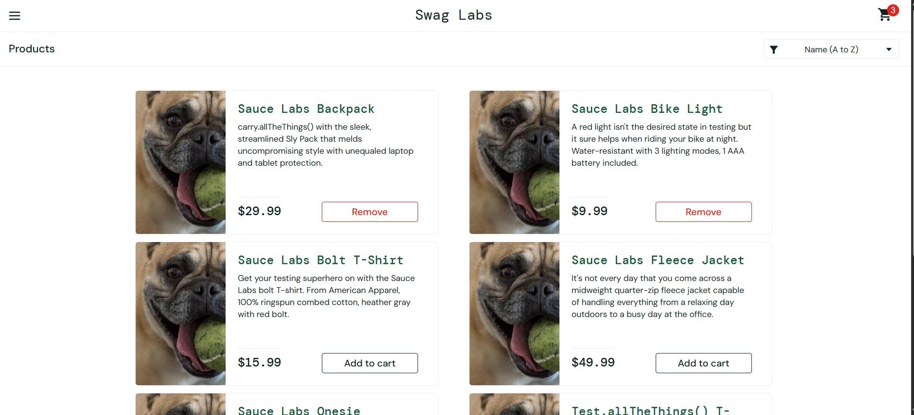
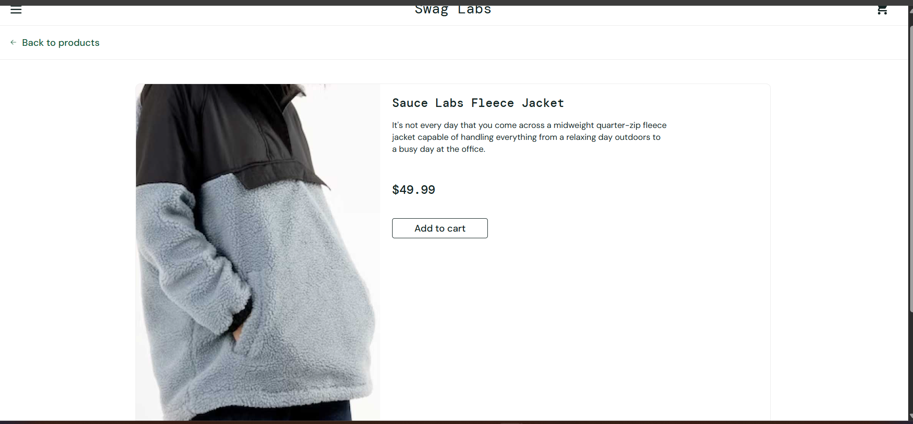
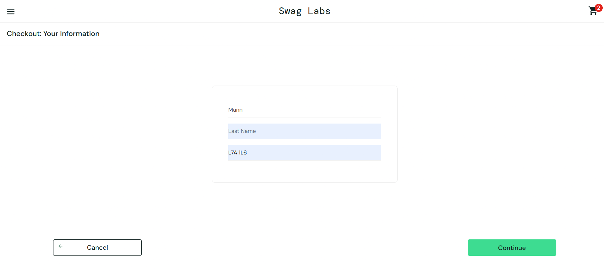

# Bug Reports: SauceDemo (`problem_user`)

Defects found while testing [SauceDemo](https://www.saucedemo.com) with the `problem_user` account.
Each bug is also covered by an automated test in [`tests/problem-user.spec.ts`](../tests/problem-user.spec.ts).

| ID | Title | Severity | Priority | Status |
|---|---|---|---|---|
| [BUG-001](#bug-001-all-products-show-the-same-image) | All products show the same image | Medium | Medium | Open |
| [BUG-002](#bug-002-sorting-does-not-change-the-product-order) | Sorting does not change the product order | Medium | Medium | Open |
| [BUG-003](#bug-003-add-to-cart-does-nothing-for-some-products) | "Add to cart" does nothing for some products | High | High | Open |
| [BUG-004](#bug-004-clicking-a-product-opens-the-wrong-product) | Clicking a product opens the wrong product | High | High | Open |
| [BUG-005](#bug-005-last-name-cannot-be-entered-blocking-checkout) | Last name cannot be entered, blocking checkout | Critical | High | Open |

**Test environment (all bugs)**
- **URL:** https://www.saucedemo.com
- **User:** `problem_user` / `secret_sauce`
- **Browser:** Google Chrome, Windows
- **Date found:** October 6, 2026
- **Control check:** none of these bugs happen with `standard_user`

**Severity scale:** Critical = blocks a core flow (e.g., buying) · High = core feature broken, no easy workaround · Medium = wrong or misleading behaviour, user can work around it · Low = cosmetic

---

## BUG-001: All products show the same image

**Severity:** Medium · **Priority:** Medium · **Area:** Products page

**Steps to reproduce**
1. Go to https://www.saucedemo.com
2. Log in as `problem_user` / `secret_sauce`
3. Look at the product images on the Products page

**Expected result:** Each product shows its own image (backpack, bike light, T-shirt, etc.).

**Actual result:** All six products show the same image, which doesn't match any of the products.

**Impact:** Customers can't see what they are buying, which may lead to wrong purchases or abandoned visits.

**Evidence:**

---

## BUG-002: Sorting does not change the product order

**Severity:** Medium · **Priority:** Medium · **Area:** Products page, sort dropdown

**Steps to reproduce**
1. Log in as `problem_user`
2. On the Products page, open the sort dropdown (top right)
3. Select **Name (Z to A)**

**Expected result:** Products are re-ordered from Z to A.

**Actual result:** The products stay in the original A to Z order.

**Impact:** Customers can't sort products to find what they want.

**Evidence:**

---

## BUG-003: "Add to cart" does nothing for some products

**Severity:** High · **Priority:** High · **Area:** Products page, cart

**Steps to reproduce**
1. Log in as `problem_user`
2. Click **Add to cart** on **Sauce Labs Fleece Jacket**

**Expected result:** The button changes to **Remove** and the cart icon shows **1**.

**Actual result:** Nothing happens. The button stays as **Add to cart** and the cart icon shows no number.

**Affected products:** Sauce Labs Fleece Jacket, TODO: add the other products where Add to cart did nothing

**Working products:** TODO: list the products where Add to cart worked

**Impact:** Customers can't buy the affected products, which means direct lost sales.

**Evidence:**

---

## BUG-004: Clicking a product opens the wrong product

**Severity:** High · **Priority:** High · **Area:** Products page, product details page

**Steps to reproduce**
1. Log in as `problem_user`
2. Click the product name **Sauce Labs Backpack**

**Expected result:** The details page for **Sauce Labs Backpack** opens.

**Actual result:** The details page for a different product opens (TODO: write the name of the product that opened).

**Impact:** Customers see the wrong description and price and could add the wrong item to their cart.

**Evidence:**

---

## BUG-005: Last name cannot be entered, blocking checkout

**Severity:** Critical · **Priority:** High · **Area:** Checkout, Your Information step

**Steps to reproduce**
1. Log in as `problem_user`
2. Add any working product to the cart (e.g., Sauce Labs Backpack)
3. Click the cart icon, then **Checkout**
4. Enter First Name `Aditi`, Last Name `Tester`, Postal Code `L7C 1A1`
5. Click **Continue**

**Expected result:** The checkout moves to the Overview step.

**Actual result:** TODO: describe exactly what you saw when typing the last name (for example: "The Last Name field stays empty and the typed letters appear in the First Name field instead"). After clicking Continue, the error **"Error: Last Name is required"** appears and the order can't continue.

**Impact:** No customer using this account can complete a purchase. This blocks the main business flow.

**Evidence:**

